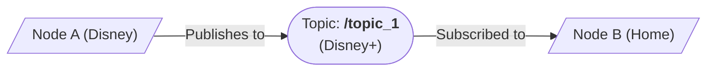
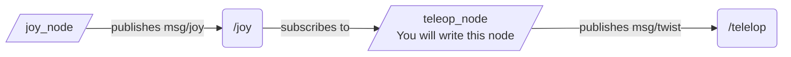

# Tutorial for Controller Teleop Package in ROS 2
## ROS 2 Overview  
Robot Operating System 2 (ROS 2) is the middleware used for creating robotic systems that have many connecting parts. Part of the beauty of this system is that you can write your programs in either C++ or Python depending on what you are comfortable with.  
  
The basic structure of ROS2 is a system of interconnected nodes and topics. Each node connects to another node by getting information through a topic. Think of node A as your house and node B as Disney. Disney sends you movies and tv shows through Disney+ which is like a topic. Node B publishes to topic /disney_plus and Node A subscribes to topic /disney_plus to receive the data. The topic is not something that you code it is simply the medium that data flows through. You only write the code for Nodes A and B which create the data that is sent and received through a topic.


As you create more and more complicated robots, the number of nodes and topics increases greatly.  

Topics are entirely managed by the the ROS 2 software while nodes are created in packages that you will create. Packages contain all the resources a node or multiple nodes need to run and send and receive data on the ROS 2 network.  

Topics generally contain send in receive information in defined packets called messages. They are similar to a struct in C++, or a data structure made up of a group of other data types. For example the message geometry_msgs/msg/Twist contains 2 basic variables with the following names and types
- Vector3 linear
- Vector3 angular

Data that is published to a topic must be sent in that format, a collection of 2 Vector3s. Similarly any data that is received when it is subscribed to is received in the same format. 

***It is essential to understand what topics a node publishes to and what message type a topic uses***
  
## Tutorial Intro
This tutorial will explain how the we can create a package to allow us to use a basic video game controller (Xbox, PS5, etc) to send commands to the ROS 2 system.
The purpose of this tutorial is not to explain how to create this package (though it will do so) but rather to teach the basic syntax and functions you will need to use ROS 2. The goal is to give you the tools that will allow you to create your own packages and nodes in C++ or Python.

#### Reference this tutorial for basic information about how to use ROS2, use the files to see specific annotated examples matching this tutorial

## Controller Package Overview
Let's establish what we want this program to do. We want to run it with a single command and be able to plug in a controller to our computer and have its output be published to a topic so that anyone in the ROS 2 network can access it easily.  

How does this work inside a ROS2 package?

We need 3 things
- A node that reads the raw controller inputs (this is a prewritten node by the ROS2 Community, we will simply run it)
- A node that subscribtes to the raw inputs and publishes the data we want
- A launcher that starts both of those nodes together

We will be using 2 topics in this program with the following messages
- /joy - sensor_msgs/msg/joy
- /teleop - geometry_msgs/msg/twist

The general structure is as follows


We will write two files that create this whole system together and allow you to run it all with one command and simply plug in a controller and run it. The node to manage the publishing and subscribing to topics, and a launcher to 

## Package Overview (C++)
Here is the file structure of a basic package in C++
```
your_package_name
├── CMakeLists.txt
├── launch
│   └── launch.py
├── LICENSE
├── package.xml
├── README.md
└──src
    └── node.cpp
```

You can create this basic structure by running the following
```bash
ros2 pkg create --build-type ament_cmake --license Apache-2.0 --node-name your_node_name your_package_name
```
## Creating the Node (C++)
We will write all the code for our node in the file ./src/your_package_name/src/your_node_name.cpp
### Basic Node Structure

```cpp
// IMPORT LIBRARIES
#include "rclcpp/rclcpp.hpp" 
// include any other libraries you may need for your program

// Define a class that extends the Node class from ROS 2
class your_class_name_here : public rclcpp::Node{
    private:
        // INSTANCE VARIABLES
        
        // MAIN FUNCTION
        void your_main_function(the_parameters){

        }
    public:
        
        // This constructor creates an object of your class and also calls the parent node class with a name given in the parameter
        // Keep it the same as your class name for consistancy
        your_class_name_here():Node("your_class_name_here"){ 
            // NODE CONSTRUCTOR
            
        }

}

// The main function simply initializes the ROS2 libraries, creates the node, and "spins" the node or checks to see if it receives data from a topic or needs to send data to a topic, it then shuts down. 

// DO NOT PUT CODE INSIDE MAIN UNLESS YOU KNOW WHAT IT DOES
// Generally all your code will go your_main_function above
int main(int argc, char** argv){
  rclcpp::init(argc, argv);
  rclcpp::spin(std::make_shared<your_class_name_here>());
  rclcpp::shutdown();
  return 0;
}

```

### Libraries
In order to use ROS 2 with C++ we must import the following library
```cpp
#include "rclcpp/rclcpp.hpp" 
```

We must then import the C++ files that define the messages that we are going to use in the program  
```cpp
#include "/path/to/msg/msg_type.hpp" 
```

### Instance variables
We need to declare any instance variables we will be using so our node can acces them from anywhere

If we plan on publishing to any topics we need a publisher for each topic we publish to
```cpp
    rclcpp::Publisher<std_msgs::msg::msg_type_pub>::SharedPtr publisher_name_;
```

If we plan on subscribing to any topics we need a subscriber for each topic we publish to
```cpp
    rclcpp::Subscription<std_msgs::msg::msg_type_sub>::SharedPtr subscription_name_;
```
*Messages are not unique to subscriptions or publishers, you can use any type of message for either however you see fit*  
Include any other variables you may need for your program to run as normal

### Node Constructor Functions
Inside the constructor we need to initialize the variables we created, especially the publishers and subscribers  

Most importantly you will define how and when your_main_function is called
The most common options are
- Calling your_main_function every time a message is received from a topic
- Calling your_main_function after a certain amount of time has passed

*We want our node to run only when it receives data from the controller so we will focus on the former*

We initialize a publisher with 2 parameters
- The name of the topic it publishes to as a string
- The queue size (amount of messages saved in a queue in the case of a backup of messages)
```cpp
    publisher_name_ = this->create_publisher<std_msgs::msg::msg_type_pub>("topic_name",10); // the topic will be seen in ROS2 as /topic_name

```
We initialize a subscriber with 3 parameters
- The name of the topic it subscribes to as a string
- The queue size (amount of messages saved in a queue in the case of a backup of messages)
- A callback to a function, this is defined with std::bind because the function must be attached to a specific object. This also has 3 parameters
    - A reference to the callback function using a reference to the function inside of its class
    - A reference to the object it will bind the function to, 'this' refers to the current object
    - A placeholder for the function argument
```cpp
    subscription_name_ = this->create_subscription<std_msgs::msg::msg_type_sub>("topic_name",10,std::bind(&your_class_name_here::joy_to_twist,this,std::placeholders::_1)); // the topic will be looked for in ROS2 as /topic_name
```
*A subscription will automatically pass the message of a topic into the parameters of the function when called*

### Main Function
We must define a function that is called. This is where the majority of the code and logic will go in a node. By default a subscription will pass in the message that was sent as a pointer to use
```cpp
    void your_main_function(const std_msgs::msg::msg_type_sub::SharedPtr msg){
        auto publish_msg = std_msgs::msg::MsgTypePub(); // creates an empty object of the message we will send

        // CREATE CODE TO FILL THE VARIABLES OF THE MESSAGE YOU WILL PUBLISH

        publisher_name_->publish(publish_msg);
    }
```

## Creating the Launcher (C++)
**Generally it is simpler to create the launcher in python and there aren't many benefits to doing it in C++. We reccommend creating all launch files in Python**
## Misc Files (C++)
Along with just creating the launcher and the node files, we also need to tell the package some additional information
### package.xml
This file tells the compiler more information about the program

Fill in any information at the top about the information of the program


Most importantly, add a new line after the ament_cmake buildtool dependency and paste the following dependencies corresponding to your node’s include statements
```xml
<depend>rclcpp</depend>
<depend>std_msgs</depend>
```

### CMakeList.txt
This file tells the compiler how to create the program
**Add all of the below to your CMakeLists file in the ./src/your_package_name/CMakeLists.txt
Below the existing dependency find_package(ament_cmake REQUIRED), add the lines for each library you import in the C++ files
```
find_package(rclcpp REQUIRED)
find_package(std_msgs REQUIRED)
```

Add the executable and with your node name so you can run your node using the command "ros2 run your_node_name". Also include any packages you included above

```
add_executable(your_node_name src/your_node_name.cpp)
ament_target_dependencies(your_node_name rclcpp std_msgs)
```

Add the install(TARGETS...) section so ros2 run can find your executable:

```txt
# This allows the ros2 run command to work

install(TARGETS
  your_node_name
  DESTINATION lib/${PROJECT_NAME})

#This allows the ros2 launch command to work
install(DIRECTORY launch
  DESTINATION share/${PROJECT_NAME})
```
## Package Overview (Python)
### Coming Soon ...
## Creating the Node (Python)
### Coming Soon ...
## Creating the Launcher (Python)
In our program we need to run two nodes so that our node gets the data that it needs from the second node. It is convienient to create a file that 'launches' both nodes simultaneously so we don't have to worry about forgetting one of them.  

Launcher files can also be launched by other launcher files which makes it a convienent way for one to launch an entire stack for the robot.  
### Launcher File
The launcher file should be found at ./src/your_package_name/launch/your_launcher.py

```python
# Import the required libraries
from launch import LaunchDescription
from launch_ros.actions import Node
from launch.actions import DeclareLaunchArgument
from launch.substitutions import LaunchConfiguration

def generate_launch_description():
    return LaunchDescription([
        # Declare a launch argument for the joystick device
        Node(
            package='your_package_name',
            executable='your_node_name', # your_node_name.cpp
            name='official_node_name', # name of the node in ROS2
        ),

        # Declare a launch argument for any other nodes if applicable
        Node(
            package='second_package_name',
            executable='second_node_name',
            name='official_second_node_name',
        )
    ])
```


### Launching the Launcher
Navigate to the root of the ROS2 workspace 
```bash
cd ~/ros2_ws

```
Build the files you just created
```bash
colcon build --packages-select your_package_name --symlink-install

```
Add the setup info to your terminal (must run for each new terminal session)
```bash
source install/setup.bash

```

Launch the launcher file
```bash
ros2 launch your_package_name your_launcher.py
```
## Misc. Files (Python)
### Coming Soon ...